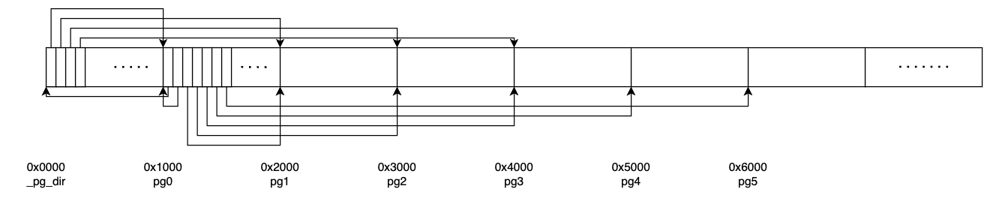
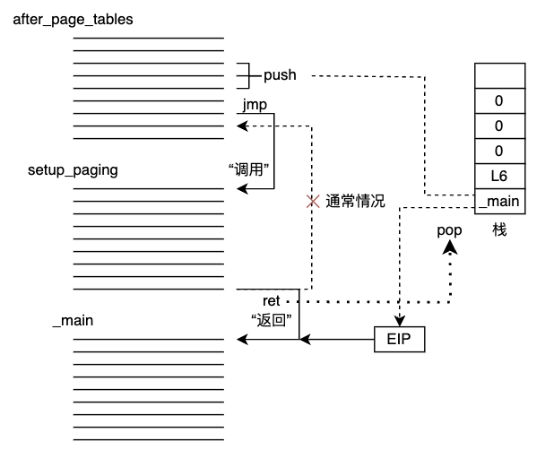
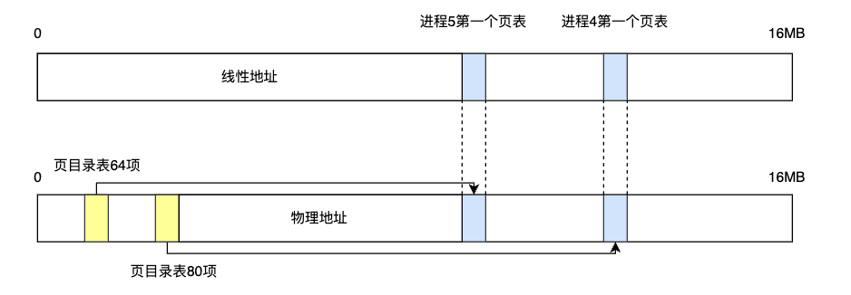

# OS思考题

## Q1-1

> 为什么开始启动计算机的时候，执行的是BIOS代码而不是操作系统自身的代码？

* **操作系统不在内存无法直接执行**：加电的一瞬间，计算机内存（RAM）中什么程序也没有。软盘里虽然有操作系统程序，但CPU的逻辑电路被设计为只能运行内存中的程序，没有能力直接从软盘运行操作系统。这就需要CPU将软盘中的操作系统程序加载到内存中。BIOS体积较小，可以固化在主板ROM中。

* **BIOS加载操作系统原理**：
  * CPU的硬件逻辑设计为加电瞬间强行将CS:IP指向BIOS程序的入口地址（0xFFFF0）；
  * BIOS在内存中加载中断向量表和中断服务程序，并通过这些中断服务程序将操作系统代码从软盘加载至内存；
  * 接着通过中断`int 0x19`将引导程序bootsect加载至内存，以及后续的一系列操作，最终将操作系统代码加载到内存中。

## Q1-2

> 为什么BIOS只加载了一个扇区，后续扇区却是由bootsect代码加载？为什么BIOS没有直接把所有需要加载的扇区都加载？

* **“两头约定”和“定位识别”：**

  BIOS和操作系统通常由不同的专业团队设计和开发的，BIOS不知道不同OS需要多少扇区。

  * 对BIOS而言，“约定”接到启动操作系统命令，“定位识别”只从启动扇区把代码加载至0x07c00(BOOTSEG)位置，但并不关心该扇区内容是什么；
  * 对操作系统而言，需要把最开始执行的代码“定位”在启动扇区（0盘面0磁道1扇区），其余程序依照操作系统的设计顺序加载在后续的扇区。

  当加载一个扇区后，操作系统就可以使用bootsect个性化地加载自身。


## Q1-3

> 为什么BIOS把bootsect加载到0x07c00，而不是0x00000？加载后又马上挪到0x90000处，是何道理？为什么不一次加载到位？

1. **0处有BIOS中断向量表和数据区**：因为BIOS将从0x00000开始的1KB字节构建了中断向量表，接着的256KB字节内存空间构建了BIOS数据区。0x07C00是BIOS设置的bootsect起始地址，有历史原因。
2. **避免启动扇区的硬件数据后续被覆盖**：依据系统对内存的规划，内核终会占用0x00000起始的空间，因此0x07C00可能会被覆盖。将bootsect挪到0x90000是操作系统的意志，将setup.s和启动扇区的硬件数据在0x90000~0x901FF处，避免main函数中设置根设备时，取不到启动扇区的ROOT_DEV数据。

## Q1-4

> bootsect、setup、head程序之间是怎么衔接的？给出代码证据。

1. **bootsect跳转至setup：`jmpi 0, SETUPSEG`**
   * 通过BIOS的int 0x13中断，找到bootsect自身的中断服务程序，将setup程序加载至SETUPSEG（0x90200处），将system模块复制到SYSSEG（0x10000）处。等到bootsect的任务完成。
   
   * 然后，通过`jmpi 0, SETUPSEG`跳转至setup程序加载位置0x90200，此时CS:IP指向setup程序的第一条指令，意味着setup程序开始执行；
   
2. **setup跳转至head：`jmpi 0, 8`**
* setup程序设置GDT、IDT，并设置CPU中专用寄存器GDTR、IDTR；
  
* 接着，打开A20，开启32位寻址模式，再对可编程中断控制器8259A进行重新编程，并设置CR0寄存器的PE位为1，即设定处理器工作方式为保护模式，以后根据GDT决定执行哪里的程序；
  
* 最后，通过`jmpi 0, 8`跳转到head程序，0表示段内偏移，8（1000）是保护模式下的段选择符，最后两位00表示内核态，第二位0表示GDT，第一位的1表示所选的表是GDT的1项，从该项得知段基址为0x00000000，结合段内偏移0，可知最终跳转至0x00000000处，执行head程序。

## Q1-5

> setup程序的最后是`jmpi 0,8`，为什么这个8不能简单的当作阿拉伯数字8看待，究竟有什么内涵？

* **[1:0]：特权级；[2]：GDT/LDT；[4:3]：第几表项**

  此时为32位保护模式，0是段内偏移，8（01000）是保护模式下的段选择子，最后两位00表示内核态，第二位0表示GDT（0：GDT，1：LDT），第一位的1表示所选的表是GDT的1项（0：空；1：代码；2：数据），来确定代码段的段基址和段限长等信息。

* 几个常见值：

  0x08：内核GDT代码段；0x10：内核GDT数据段；0x0f：用户LDT代码段；0x17：用户LDT数据段

## Q1-6

> 保护模式在“保护”什么？它的“保护”体现在哪里？特权级的目的和意义是什么？分页有“保护”作用吗？

1. **保护模式依赖GDT寻址，有段限长**：

   打开保护模式后，CPU的寻址方式发生了变化，需要依赖于GDT去获得代码段或数据段的描述符，进而得到代码段或数据段的基址；保护模式除了段基址外，还有段限长，这样即有效地防止了对代码段、数据段的覆盖，又防止代码段自身的访问超限，明显增强了保护作用；

2. **描述符表的界限、特权级和特权指令检查**：

   保护模式的“保护”体现在，在GDT、LDT和IDT中，均有自己的界限、特权级等属性，这是对描述符所描述对象的保护；在不同特权级间的访问时，系统会对CPL、RPL、DPL、IOPL等进行检验，对不同层级的程序进行保护，同时还限制某些特殊指令的使用，如lgdt，lidt，cli等；

3. 特权级的目的：使操作系统能够掌握**线性地址**，而用户进程只能使用**逻辑地址**，并实现对用户的**访问控制**

   特权级的意义：使得操作系统内核可以执行一切指令，访问任何物理地址，访问任何用户进程，但是**用户进程不能访问操作系统内核，也不能相互访问**；

4. **页级保护和地址映射**：分页具有“保护”作用。

   * 分页机制中的PDE和PTE中的R/W和U/S等，提供了页级保护；
   * 分页机制将线性地址与物理地址加以映射，使得内核可以直接访问任何一个进程的内存空间，而用户进程只能面对一个逻辑地址，先转化为线性地址，再根据内核提供的分页方案转化为物理地址，内核代码和所有进程的物理内存分配完全由内核掌控。

## Q1-7

> 在setup程序里曾经设置过gdt，为什么在head程序中将其废弃，又重新设置了一个？为什么设置两次，而不是一次搞好？

1. **原GDT会被覆盖且新的是保护模式**：

   * 原来GDT所在的位置是设计代码时在setup.s里面设置的数据，将来这个setup模块所在的内存位置会在设计缓冲区时被覆盖，如果不改变位置，将来GDT的内容肯定会被缓冲区覆盖掉，从而影响系统的运行，这样一来，将来整个内存中唯一安全的地方就是现在head.s所在的位置了。
   * 新建的GDT是32位保护模式的GDT

2. **移动system和复制GDT有冲突**：

   不能在执行setup程序时直接将GDT的内容复制到head.s所在的位置：如果先复制GDT的内容，后移动system模块，GDT就会被后者覆盖；如果先移动system模块，后复制GDT的内容，它又会把head.s对应的程序覆盖，而此时head.s还没有执行。

## Q1-8

> 内核的线性地址空间是如何分页的？画出从0x000000开始的7个页(包括页目录表、页表所在页)的挂接关系图，就是页目录表的前四个页目录项、第一个个页表的前7个页表项指向什么位置？给出代码证据。

1. **4K分页，第一个页作页目录，第二到五页作内核页表**

   内核使用页目录表中4个表项，4个页表（每个1K项，每项管理4K），从而管理16M内存。

   * head.s在setup_paging开始创建分页机制，从内存起始位置开始的5页空间内容全部清零，
   * 然后设置页目录表的前4项，使之分别指向4个页表，然后将第四个页表的最后一项（pg3+4092指向的位置）指向寻址范围的最后一个页面（即0xFFF000）开始的4KB大小的内存空间，
   * 从高地址向低地址方向填写4个页表，使得页表中的每一个页表项分别指向内存从高地址到低地址方向的各个页面。

2. 页目录表的前四个页目录表项依次指向0x1000, 0x2000, 0x3000, 0x4000，第一个页表的前7个表项依次指向0x0000, 0x1000, 0x2000, 0x4000, 0x5000, 0x6000。

   

3. 代码证据：

   ```assembly
   	movl $pg0 + 7, _pg_dir # 设置存在位（存在）、用户特权位（用户）和读写位（可读写）
   	movl $pg1 + 7, _pg_dir + 4
   	movl $pg2 + 7, _pg_dir + 8
   	movl $pg3 + 7, _pg_dir + 12
   	movl $pg3 + 4092, %edi
   	movl $0xfff007, %eax # 0xfff000基址+存在、用户、可读写
   	std
   1: 	
   	stosl # 由高到低填写所有页表项
   	subl $0x1000, %eax
   	jge 1b
   ```

## Q1-9

> 根据内核分页为线性地址恒等映射的要求，推导出四个页表的映射公式，写出页表的设置代码。

页表设置代码见Q1-8第3问

对于$i$页表的$j$项，它指向的页起始位置：（$0\le i\le3 $，$0\le j \le 999$）
$$
4096\times(i\times1000+j)
$$

## Q1-10

> 为什么不用call，而是用ret“调用”main函数？画出调用路线图，给出代码证据。

1. **OS的main不应该返回**：

   * call的行为：将EIP的值自动压栈，保护返回现场，然后执行被调函数的程序，等到执行被调函数的ret指令时，自动出栈给EIP并还原现场，继续执行call的下一行指令。
   * 但是对于操作系统的main函数来说，由于操作系统是最底层的系统，所以不需要返回，因此手工编写代码压栈和跳转，用ret指令调用main函数。

2. 路线图：

   

3. 代码证据：

   ```assembly
   after_page_tables:
   	pushl $0		# These are the parameters to main
   	pushl $0
   	pushl $0
   	pushl $L6		# return address for main, if it decides to.
   	pushl $_main
   	jmp setup_paging
   ......
   setup_paging:
   ......
   ret						#	this also flushes prefetch-queue
   ```

## Q2-1

> 计算内核代码段、数据段的段基址、段限长、特权级。

这些信息储存在head.s的gdt初始表项中

* 内核代码段：段基址：0x000000，段限长：16MB，特权级：内核态

* 内核数据段：段基址：0x000000，段限长：16MB，特权级：内核态

## Q2-2

> 计算进程0的代码段、数据段的段基址、段限长、特权级。

这些信息存储在sched.h中

* 进程0代码段：段基址：0x000000，段限长：640KB，特权级：内核态                                                                                                                                                                                                                                                                                                                                                                                                                                                                                                                                                                                                                                                                                                                                                                                                                                                                                                                                                                                                                                                                                                                                                                                                                                                                                                                                                                                                                                                                                                                                                                                                                                                                                                                                                                                                                                                                                                                                                                                                                                                                                                                                                                                                                                                                                                                                                                                                                                                                                                                                                                                                                                                                                                                                                                                                                                                                                                                                                                                                                                                                                                                                                                                                                                                                                                                                                                                                                                                                                                                                                                                                                                                                                                                                        

* 进程0数据段：段基址：0x000000，段限长：640KB，特权级：内核态

## Q2-3

> fork进程1之前，为什么先调用move_to_user_mode()？用的是什么方法？解释其中的道理。

1. **linux操作系统规定，除进程0之外，所有进程都要由一个已有进程在3特权级下创建**：进程0在正式创建进程1之前，要由0特权级转变为3特权级。

2. **模拟中断返回**：

   * 按SS、ESP、EFLAGS、CS、EIP的顺序手工写压栈代码模拟中断的压栈，

   * 设置SS、CS的特权级为3，

   * 执行iret指令时，CPU自动将这5个寄存器的值按序恢复给CPU，CPU就会翻转到3特权级的段，执行3特权级的进程代码。

     （原理是CPU响应中断的时候，根据DPL的设置，可以实现指定特权级之间的反转）

## Q2-4

> 根据什么判定move_to_user_mode()中iret之后的代码为进程0的代码。

1. **在执行iret前进程0后续代码的eip入栈了**，因此iret一定回到了进程0的代码

2. **iret之后的代码目的是为了设置用户模式下的各种段寄存器（DS、ES、FS、GS）的值与SS相同**，确保所有的段寄存器都正确设置为用户模式的段寄存器

## Q2-5

> 进程0的task_struct在哪？具体内容是什么？给出代码证据。

1. **内核数据段**，在代码中位于sched.h中的INIT_TASK

2. 包括状态、信号、pid、alarm、ldt、tss等**管理该进程所需的数据**

3. 代码证据：

   ```assembly
   // sched.c
   union task_union {
   	struct task_struct task;
   	char stack[PAGE_SIZE];
   };
   static union task_union init_task = {INIT_TASK,};
   struct task_struct * task[NR_TASKS] = {&(init_task.task), };
   // sched.h
   #define INIT_TASK \
   /* state etc */	{ 0,15,15, \
   /* signals */	0,{{},},0, \
   /* ec,brk... */	0,0,0,0,0,0, \
   /* pid etc.. */	0,-1,0,0,0, \
   /* uid etc */	0,0,0,0,0,0, \
   /* alarm */	0,0,0,0,0,0, \
   /* math */	0, \
   /* fs info */	-1,0022,NULL,NULL,NULL,0, \
   /* filp */	{NULL,}, \
   	{ \
   		{0,0}, \
   /* ldt */	{0x9f,0xc0fa00}, \
   		{0x9f,0xc0f200}, \
   	}, \
   /*tss*/	{0,PAGE_SIZE+(long)&init_task,0x10,0,0,0,0,(long)&pg_dir,\
   	 0,0,0,0,0,0,0,0, \
   	 0,0,0x17,0x17,0x17,0x17,0x17,0x17, \
   	 _LDT(0),0x80000000, \
   		{} \
   	}, \
   }
   ```

## Q2-6

> 6、在system.h里
>
> ```assembly
> #define _set_gate(gate_addr,type,dpl,addr) \
> __asm__ ("movw %%dx,%%ax\n\t" \
>     "movw %0,%%dx\n\t" \
>     "movl %%eax,%1\n\t" \
>     "movl %%edx,%2" \
>     : \
>     : "i" ((short) (0x8000+(dpl<<13)+(type<<8))), \
>     "o" (*((char *) (gate_addr))), \
>     "o" (*(4+(char *) (gate_addr))), \
>     "d" ((char *) (addr)),"a" (0x00080000))
> 
> #define set_intr_gate(n,addr) \
>     _set_gate(&idt[n],14,0,addr)
> 
> #define set_trap_gate(n,addr) \
>     _set_gate(&idt[n],15,0,addr)
> 
> #define set_system_gate(n,addr) \
>     _set_gate(&idt[n],15,3,addr)
> ```
>
> 读懂代码。这里中断门、陷阱门、系统调用都是通过_set_gate设置的，用的是同一个嵌入汇编代码，比较明显的差别是dpl一个是3，另外两个是0，这是为什么？说明理由。

**系统调用用户级，中断、陷阱系统级**

* dpl表示描述符特权级，dpl为0仅内核处理，dpl为3用户特权级可调用；
* 中断门和陷阱门为内核使用，禁止用户进程调用，因此dpl为0；
* 当用户程序产生系统调用后，系统通过system_call找到具体的系统调用处理函数，因此dpl需要设置为3。

## Q2-7

> 分析get_free_page()函数的代码，叙述在主内存中获取一个空闲页的技术路线。

1. **找到空闲，增加引用**：

   * 省流：由高到低遍历mem_map数组，找到主内存中第一个空闲页面，引用计数置1；
   * 详细：将eax设置为0，edi指向mem_map的最后一项（mem_map+PAGING_PAGES-1），std设置扫描从高地址到低地址，遍历mem_map[]，从mem_map的最后一项反向扫描，找出引用次数等于AL（0）的页，如果没有就退出，如果找到，则将找到的页面的引用计数设置为1；

2. **计算地址，页面清零**

   * 省流：ecx左移12位并加上LOW_MEM得到该页的物理地址，再将页面清零，

   * 详细：将ecx左移12位并加上LOW_MEM得到物理地址，将此页的最后一个字节的地址赋值给edi（LOW_MEM+4092）；stosl将eax的值设置到es:edi指向的内存，即反向清零1024*32bit，将此页清空；

3. **地址返回**

   * 将本页的地址（存放在eax中）返回，找不到就直接返回。

## Q2-8

> copy_process函数的参数最后五项是：long eip,long cs,long eflags,long esp,long ss。查看栈结构确实有这五个参数，奇怪的是其他参数的压栈代码都能找得到，却找不到这五个参数的压栈代码，反汇编代码中也查不到，请解释原因。详细论证其他所有参数是如何传入的。

**int 0x80自动压栈**

* copy_process执行是因为进程调用了fork函数，fork是一个系统调用，会导致中断，int 0x80中断使CPU硬件自动将SS、ESP、EFLAGS、CS、EIP按顺序自动压栈到进程0的内核栈中，又因为函数传递参数使用栈，所以刚好可以作为copy_process的最后五项参数。
  * 在system_call中对DS、ES、FS、EDX、ECX、EBX参数进行压栈
  * 在执行call _sys_call_table时对long none参数进行压栈，
  * 在sys_fork中对GS、ESI、EDI、EBP、EAX进行压栈，其中EAX参数就是int nr。

## Q2-9

> 详细分析Linux操作系统如何设置保护模式的中断机制。

**挂接中断服务程序和IDT表项**：trap_init函数

* 通过set_trap_gate(n,addr)设置陷阱门

* 通过set_intr_gate(n,addr)设置中断门

* 通过set_system_gate设置系统调用

  以上操作都是使用_set_gate(gate_addr,type,dpl,addr)将中断描述符表的内容填写到IDT对应的表项上。

## Q2-10

> 分析Linux操作系统如何剥夺用户进程访问内核及其他进程的能力。

**所有程序的访问都是基于段的。**

1. 从一个进程非法跨越到另一个进程时：

   **被LDT基址限长限制**：每个进程有自己的LDT，CS都是指向用户级LDT的，执行时的逻辑地址被按照自己的段基址和段限长进行转换，因此只能访问到自己的线性地址空间。

2. 从一个进程非法跨越到内核：

   **硬件特权级检查**：用户进程代码段的特权级都是3，内核的特权级是0，CPU硬件禁止代码跨越特权级的长跳转。

## Q2-11

> ```assembly
> _system_call:
>     cmpl $nr_system_calls-1,%eax
>     ja bad_sys_call
> ```
>
> 分析后面两行代码的意义。

**检查系统调用是否在已定义范围内**

* 程序执行系统调用时，会将对应的函数编号赋值给eax，nr_system_calls是操作系统定义的系统调用总数，

  * 第一行代码是在比较系统调用总数减一的值与eax的值的大小，

  * 第二行代码表示，若eax的值大于系统调用总数减一，则跳转到bad_sys_call，这是处理无效系统调用的代码部分，如果程序尝试执行一个不存在的调用（调用号超过了有效范围），执行流程将跳转到这里。
  * 这段代码用于检查程序发出的系统调用号是否在有效范围内，若系统调用号有效，则将继续进行系统调用的处理，否则将跳转至错误处理代码，保证了内核中处理系统调用的安全运行。


## Q3-3

> 分析copy_page_tables()函数的代码，叙述父进程如何为子进程复制页表。

1. **检查对齐和合法性**：

   * 检查源、目标地址都是4KB对齐的；
   * 计算父子所有页目录表项，对于每一个表项，若子目录表项已经存在则panic，父目录项不存在则跳过。

2. **为子进程页表申请空间并复制**：

   * 对每一个页目录表项，找到其页表，
   * 为子进程页表申请一个空闲页，设置子进程页目录表指向这新申请的页上，
   * 将父进程的1024个页表项复制到这个页面中（若父进程为进程0则只复制160项，即640KB，进程0的段限长），

3. **设置父子页表属性**

   * 将父子页属性设置为用户只读。（这时子进程和父进程的页表暂时指向了相同的页面）
   * 根据条件增加页引用计数。
   * 用重置CR3的方法刷新页变换高速缓存（TLB）。

## Q3-4

> 进程0创建进程1时，为进程1建立了task_struct及内核栈，第一个页表，分别位于物理内存两个页。请问，这两个页的位置，究竟占用的是谁的线性地址空间，内核、进程0、进程1、还是没有占用任何线性地址空间？说明理由（可以图示）并给出代码证据。

这两页占用了**内核的地址空间**。省流原因：**内核16MB地址空间，在16MB末端申请的页，进程0太短，进程1从64MB开始。**

在head.s中：

```assembly
setup_paging:
	......
	movl $pg3+4092,%edi
	movl $0xfff007,%eax		/*  16Mb - 4096 + 7 (r/w user,p) */
	std
1:	
	stosl			/* fill pages backwards - more efficient :-) */
	subl $0x1000,%eax
	......
```

上面的代码，指明了内核的线性地址空间为0x000000-0xffffff，且线性地址与物理地址呈现一一对应的关系。

进程0的线性地址空间是内存前640KB，因为进程0的局部描述符如下：

```c
// sched.h
INIT_TASK:
/*ldt*/ 
{0x9f,0xc0fa00}.\
{0x9f,0xc0f200},\
```

进程0段限长导致进程0无法访问位于线性地址空间16MB末端的页，而进程1线性地址空间起始就在64MB，故只能占用内核的线性地址空间。

## Q3-5

> 假设：经过一段时间的运行，操作系统中已经有5个进程在运行，且内核为进程4、进程5分别创建了第一个页表，这两个页表在谁的线性地址空间？用图表示这两个页表在线性地址空间和物理地址空间的映射关系。

**在内核的地址空间**。

copy_mem函数中指出，进程顺序排列在线性地址空间上，**每一个进程占据64MB，需要16K个页表项，也就是16个页表，对应了16个页目录表项**。因此，进程4占据了页目录表的64-79项，进程5占据了页目录表的80-96项。由于进程4先被创建，因此其第一个页表的地址要大于进程5：



## Q3-6

> ```c
> #define switch_to(n) {\
> struct {long a,b;} __tmp; \
> __asm__("cmpl %%ecx,_current\n\t" \
>     "je 1f\n\t" \
>     "movw %%dx,%1\n\t" \
>     "xchgl %%ecx,_current\n\t" \
>     "ljmp %0\n\t" \
>     "cmpl %%ecx,_last_task_used_math\n\t" \
>     "jne 1f\n\t" \
>     "clts\n" \
>     "1:" \
>     ::"m" (*&__tmp.a),"m" (*&__tmp.b), \
>     "d" (_TSS(n)),"c" ((long) task[n])); \
> }
> ```
>
> 代码中的"ljmp %0\n\t" 很奇怪，按理说jmp指令跳转到得位置应该是一条指令的地址，可是这行代码却跳到了"m" (*&__tmp.a)，这明明是一个数据的地址，更奇怪的，这行代码竟然能正确执行。请论述其中的道理。

**m约束解释数地址，b成员恢复TSS**

tmp.a代表段内偏移，对应EIP，tmp.b代表段选择子，在第5行已经被赋值为进程的tss地址。ljmp指令的操作数由于有m约束，因此编译器解释为变量地址，顺序展开后成为tmp.a和tmp.b，通过任务门机制，ljmp识别到这是一个tss的地址，因此只考虑tmp.b的值，触发了上下文切换，新进程的tss数据被恢复给CPU的各个寄存器，实现了任务切换。

## Q3-7

> 进程0开始创建进程1，调用fork()，跟踪代码时我们发现，fork代码执行了两次，第一次，执行fork代码后，跳过init()直接执行了for(;;) pause()，第二次执行fork代码后，执行了init()。奇怪的是，我们在代码中并没有看到转向fork的goto语句，也没有看到循环语句，是什么原因导致fork反复执行？请说明理由（可以图示），并给出代码证据。

省流：**创建者返回的是last_pid，是1；被创建者被调度的“返回值”是eax，是强制为0**

fork为inline函数，其中调用了sys_call0，产生0x80中断，将ss, esp, eflags, cs, eip压栈，其中eip为int 0x80的下一句的地址。

第一次fork由进程0调用，调用后在 copy_process 中，内核将进程0的tss复制得到进程1的tss，并将进程1的tss.eax设为0：

```c
p->tss.eip = eip;
p->tss.eflags = eflags;
p->tss.eax = 0;
```

随后copy_process返回，将last_pid，现在为1，通过eax压栈返回

```c
_system_call:
	......
	call _sys_call_table(,%eax,4)
	pushl %eax
```

last\_pid将会被送入\_\_res，返回到“if (\_\_res >= 0)”执行，此时\_\_res的值为eax的值1，此时返回1，”if (!fork())”判断为假，跳过后执行pause()，此时，进程0仍然执行，进入pause()进行调度.

调度通过schedule函数进行，其中的swtich\_to中ljmp指令使用任务门机制，将进程1的tss复原到CPU的寄存器中。进程1的EIP存入的是fork函数中的”if (\_\_res >= 0)”，EAX也不再是last\_pid，而是进程1的TSS写入的0，即返回的\_\_res为0，即fork返回0，此时“if (!fork())”判断为真，执行init()。

## Q3-8

> 详细分析进程调度的全过程。考虑所有可能（signal、alarm除外）。

首先从task[64]中寻找一个进程，有以下几种情况：

1. **进程中有就绪进程，且时间片没有用完。**

   正常情况下，schedule()函数首先扫描任务数组。通过比较每个就绪（TASK_RUNNING）任务的运行时间递减滴答计数counter的值来确定当前哪个进程运行的时间最少。哪一个的值大，就表示运行时间还不长，于是就选中该进程，最后调用switch_to()执行实际的进程切换操作

2. **进程中有就绪进程，但所有就绪进程的时间片都用完**

   根据每个处于就绪态进程的优先权值priority，对系统中所有的进程(包括睡眠的进程)重新计算每个任务需要的时间片值（$counter=counter/2+priority$），然后再找出所有就绪态任务中时间片最长的，调用switch切换进程。

3. **所有进程都不是就绪态**，则while循环直接break，switch_to(0)，切换到进程0进行。

随后，执行switch\_to函数，使用ljmp的任务门机制，将原进程的各个寄存器值保存在对应的TSS中，并从对应的TSS中恢复即将执行的进程给CPU寄存器。

## Q3-9

> 分析panic函数的源代码，根据你学过的操作系统知识，完整、准确的判断panic函数所起的作用。假如操作系统设计为支持内核进程（始终运行在0特权级的进程），你将如何改进panic函数？
>
> ```c
> volatile void panic(const char * s){
> 	printk("Kernel panic: %s\n\r",s);
> 	if (current == task[0])
> 		printk("In swapper task - not syncing\n\r");
> 	else
> 		sys_sync();
> 	for(;;);
> }
> ```

1. 省流：panic函数是当系统发现无法继续运行下去的故障时调用它，会导致程序终止，由系统显示错误号，如果出现错误的函数不是进程0，则进行数据同步，把缓冲区的数据尽量同步到硬盘上去。

   详细：panic()函数的执行分为两种情况，如果是0进程调用了panic()说明在创建进程1的过程中出现了严重错误不可继续执行，且此时不涉及与硬盘中数据的交互，所以这时直接让系统执行死循环for(;;)，且这个时候系统中也不存在可调度的进程，整个电脑死机，如果是其他进程调用了panic()，则说明是某个用户进程出现严重错误，这个过程中可能涉及缓冲区数据没有写回硬盘的情况，所以在死循环之前，需要将缓冲区中未写回的数据写回硬盘，保证程序执行后硬盘中数据的一致性，所以需要调用sys_sync()写回数据，而且这个时候系统也能够完成本次工作。

2. 改进：将死循环改成跳到内核进程（始终运行在0特权级的进程），让内核继续执行。


## Q3-10

> getblk函数中，申请空闲缓冲块的标准就是b_count为0，而申请到之后，为什么在wait_on_buffer(bh)后又执行if（bh->b_count）来判断b_count是否为0？

等待缓冲区解锁的时间，缓冲块可能会被别的进程占用，因此需要再判断一下b\_count是否为0，如果不为0，需要重新申请。

## Q3-11

> b_dirt已经被置为1的缓冲块，同步前能否被进程继续读、写？给出代码证据。

1. 同步前可以被进程读写、但不能挪作他用（即关联其他物理块）。

   b_dirt是针对硬盘方向的，进程与缓冲块方向由b_uptodate标识，只要b_uptodate为1，缓冲块就能被进程读写。在块脏之后，读操作不会改变缓冲块中数据的内容，写操作后，改变了缓冲区内容，但由于这个缓冲块中的数据此前已经用磁盘数据块的数据更新过，所以写入新数据后，缓冲块中没有新写入的数据部分仍然与磁盘同步，将来同步的数据也都是进程希望同步到磁盘上的，不会把垃圾数据同步到数据块中，所以b_uptodate依然是1。

2. 代码依据：读写与b_dirt无关

   ```c
   int file_write(struct m_inode * inode, struct file * filp, char * buf, int count){
   	......
   	if (filp->f_flags & O_APPEND)
   		pos = inode->i_size;
   	else
   		pos = filp->f_pos;
   	while (i<count) {
   		if (!(block = create_block(inode,pos/BLOCK_SIZE)))
   			break;
   		if (!(bh=bread(inode->i_dev,block)))
   			break;
   	......
   }
   int file_read(struct m_inode * inode, struct file * filp, char * buf, int count){
   	......
   	if ((left=count)<=0)
   		return 0;
   	while (left) {
   		if (nr = bmap(inode,(filp->f_pos)/BLOCK_SIZE)) {
   			if (!(bh=bread(inode->i_dev,nr)))
   				break;
   		} 
   	......
   }
   ```

## Q3-12

> wait_on_buffer函数中为什么不用if()而是用while()？

**进程调度导致加锁条件变化**

有可能**很多进程都在等待一个缓冲块**。在缓冲块同步完毕后，唤醒等待进程到轮转到某一进程的过程中，**很有可能之前等的缓冲块被别的进程占用并加锁**，使得加锁条件变化。如果使用if，则该进程被唤醒以后回来不再判断缓冲块是否被占用，而直接使用，就会导致出错，使用while，就会再判断一下缓冲块是否被占用，确认未被占用后使用，就不会发生之前的错误。

## Q3-13

> 分析ll_rw_block(READ,bh)读硬盘块数据到缓冲区的整个流程（包括借助中断形成的类递归），叙述这些代码实现的功能。

1. **检查设备是否存在，以及该设备请求项函数是否挂接**

   进入ll_rw_block()函数后，先判断缓冲块对应的设备是否存在以及这个设备的请求项函数是否挂接正常，如果存在且正常，说明可以操作这个函数，调用make_request()函数，准备将缓冲块和请求项建立关系；

2. **make_request：加锁缓冲块、申请空闲请求项，挂接缓冲块**

   先将这个缓冲块加锁，目的是保护这个缓冲块在解锁之前将不再被任何进程操作，然后，在请求项结构中，申请一个空闲请求项，准备与这个缓冲块相挂接：读请求从整个请求项的最末端开始寻找空闲请求项，写请求从整个结构的2/3处申请空闲请求项，缓冲块和请求项正式挂接后，对这个请求项的各个成员进行初始化；

3. **add_request：向请求项队列加载该请求项**

   之后调用add_request()函数，向请求项队列中加载该请求项，先对当前硬盘的工作情况进行分析，并调用硬盘请求项处理函数dev->request_fn()，即do_hd_request()函数去给硬盘发送读盘命令；

4. **do_hd_request：解析请求项成员并下达读盘命令**

   为读硬盘做最后的准备工作，先通过对当前请求项数据成员的分析，解析出需要操作的磁头、扇区、柱面、操作多少个扇区......之后，建立硬盘读盘必要的参数，将磁头移动到0柱面，之后针对命令的性质（读/写），调用hd_out()函数来下达最后的硬盘操作指令，挂接中断响应程序，下达命令，读盘命令下，硬盘将引导块中的数据不断读入它的缓存中，同时，程序也返回了，沿着调用的反方向，一直返回到bread()函数中。

5. **切换至0进程等待读盘**

   等待读磁盘，切换到进程0执行。之后由于进程1被设置为了不可中断等待状态，0进程会一直被调度。直至出现了磁盘中断。

6. **响应磁盘中断并再次挂接read_intr**

   磁盘中断到来，处理器开始执行响应程序\_hd\_interrupt，随后进入read_intr执行。这个函数会将已经读到硬盘缓存中的数据复制到被锁定的缓存块中。由于磁盘只读取了一半的数据，内核再次挂接read_intr到硬盘中断服务程序。之后回到进程0，等待所有磁盘读取完毕后切换到进程1。

## Q4-5

> 分析包括安装根文件系统、安装文件系统、打开文件、读文件在内的文件操作。

1. 安装根文件系统：根文件系统挂在super_block[8]上，加载根文件系统最重要的标志就是把根文件系统的根i节点挂在super_block[8]中根设备对应的超级块上。
   * 复制根设备的超级块到super_block[8]中，将根设备中的根i节点挂在super_block[8]中对应根设备的超级块上
   * 将驻留缓冲区中16个缓冲块的根设备逻辑块位图、i节点位图分别挂接在super_block[8]中根设备超级块的s_zmap[8]、s_imap[8]上。
   * 将当前进程的pwd、root指针指向根设备的根i节点。

2. 安装文件系统：安装文件系统就是在根文件系统的基础上，把硬盘中的文件系统安装在根文件系统上，使操作系统也具备以文件的形式与硬盘进行数据交互的能力。
   * 将硬盘上的超级块读取出来，并载入系统中的super_block[8]中
   * 将虚拟盘上指定的i节点读出，并将此i节点加载到系统的inode_table[32]中
   * 将硬盘上的超级块挂载到inode_table[32]中指定的i节点上

3. 打开文件：确定进程操作那个文件

   * 将用户进程task_struct中的*filp[20]与内核中的file_table[64]进行挂接；

   * 将用户进程需要打开的文件对应的i节点在file_table[64]中进行登记。

4. 读文件：读从用户进程打开的文件中读取数据，读文件由read函数完成。

   * 确定数据块在外设中的位置；

   * 将数据块读入缓冲块；

   * 将缓冲块中的数据复制到进程空间。

## Q4-6

> 在创建进程、从硬盘加载程序、执行这个程序的过程中，sys_fork、do_execve、do_no_page分别起了什么作用？

1. sys_fork：寻找空闲的task，复制进程

2. do_execve：
   * 检测i节点属性和文件头属性，确定shell程序是否具备加载和执行条件；
   * 加载参数和环境变量，调整进程2的管理结构，为执行shell程序调整eip和esp

3. do_no_page：先确定缺页的原因，假如是需要加载程序才缺页，会尝试与其他进程共享shell，如果无法共享，则申请一个新的页面，调用bread_page()函数，从虚拟盘上读取4块shell程序内容，载入内存页面，并对物理页面超过进程end_data位置的部分进行处理。